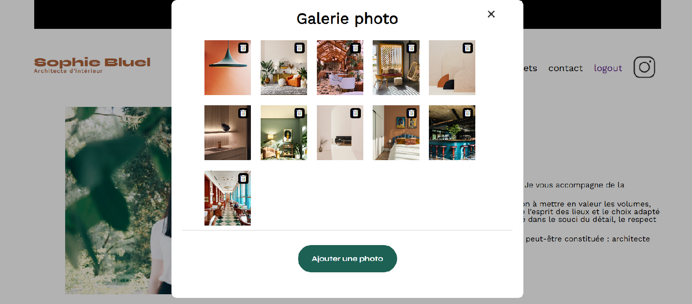

Présentation du projet 6 Créez une page web dynamique avec JavaScript:

Ce projet fait partie du parcours Développeur Web sur OpenClassrooms. L'objectif est de dynamiser une page web statique en intégrant du JavaScript pour interagir avec une API, gérer l'affichage dynamique des données et permettre des actions utilisateur comme l'ajout ou la suppression d'éléments.

Objectifs pédagogiques:

Manipuler le DOM avec JavaScript
Utiliser Fetch API pour interagir avec une API REST
Gérer des événements utilisateur (clics, soumissions de formulaires…)
Implémenter un système d'authentification simple
Dynamiser une interface utilisateur en fonction des actions de l'utilisateur

Fonctionnalités développées: 

Affichage dynamique des œuvres depuis l'API
Filtrage des œuvres par catégorie
Authentification de l'utilisateur pour l'administration
Ajout et suppression d'œuvres via un formulaire sécurisé
Documentation et test de l'API avec Swagger

Technologies utilisées:

HTML5 & CSS3 pour la structure et le style
JavaScript (ES6+)
API Fetch pour la récupération et l'envoi de données
Node.js et Express.js pour le backend
SQLite pour la gestion de la base de données
Swagger pour la documentation et le test des routes API
Live Server pour l'exécution du projet en local
